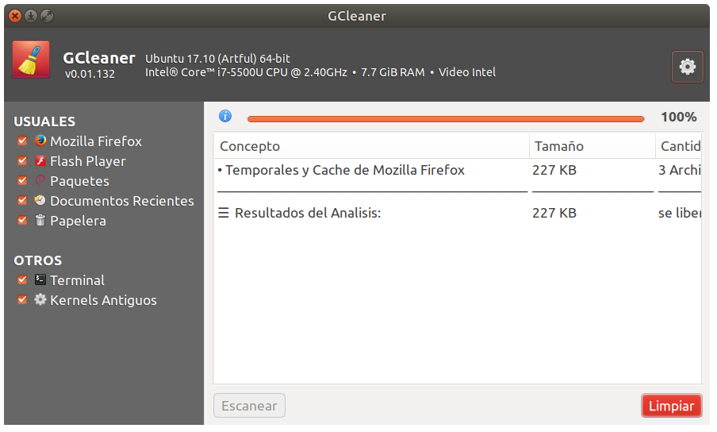

# GCleaner2
An easy system cleaner for Linux, written for elementaryOS/Ubuntu. Forked from [GCleaner](https://launchpad.net/gcleaner) by Juan Pablo Lozano, which looks like it's unmaintained.



Currently it's only available in Spanish.

## Installation

Dependencies:
```
    debhelper (>= 7)
    build-essential
    cmake
    automake
    autoconf
    gksu
    pkg-config
    valac
    libgtk-3-dev
    libgranite-dev (>= 0.3.1)
    libglib2.0-dev
```

Installation:
```
$ bzr branch lp:gcleaner
$ cd gcleaner
$ mkdir build
$ cd build
$ cmake -DCMAKE_INSTALL_PREFIX=/usr ..
$ make
$ sudo make install
```
Uninstall
```
$ sudo make uninstall
```


